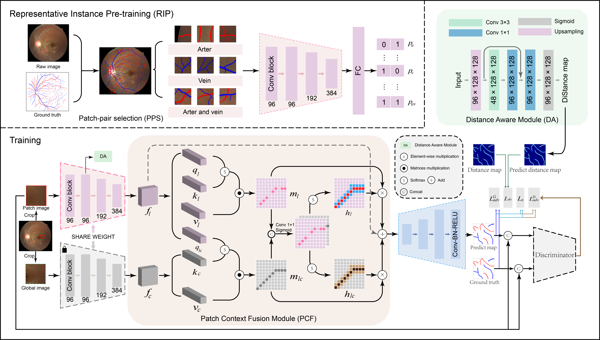

# RIP-AV: Joint Representative Instance Pre-training and Context Aware Network for Retinal Artery/Vein Segmentation 

- Contribution
  - The first attempt to joint the Representative Instance Pre-training (RIP) with the contextual analysis of local patch for retinal A/V segmentation.
  - The RIP task is proposed to learn latent arteriovenous features from diverse spatial regions. 
  - Distance Aware and Patch Context Fusion modules are desgined to explore the relationship of patch and its context base on the sense of vascular structures.
  - Validated against three datasets, outperforming state-of-the-art methods.    

