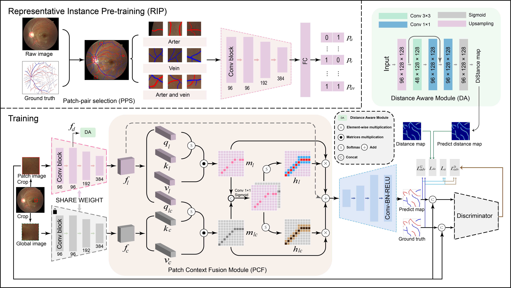
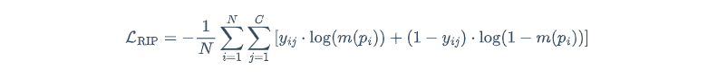
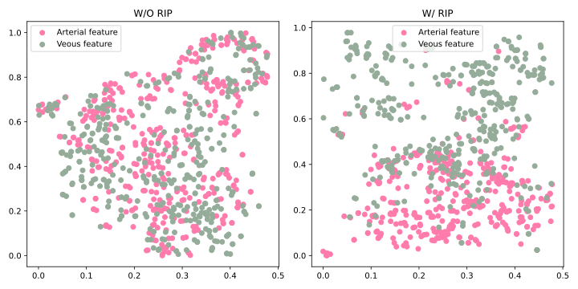
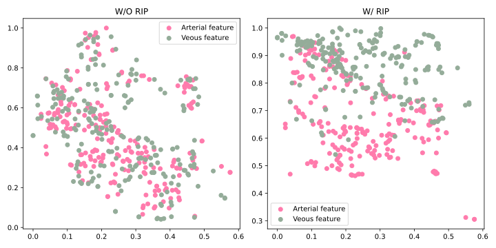
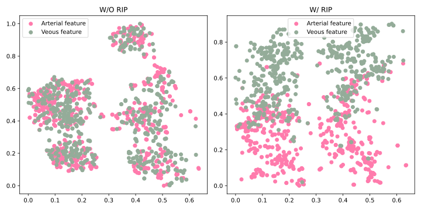
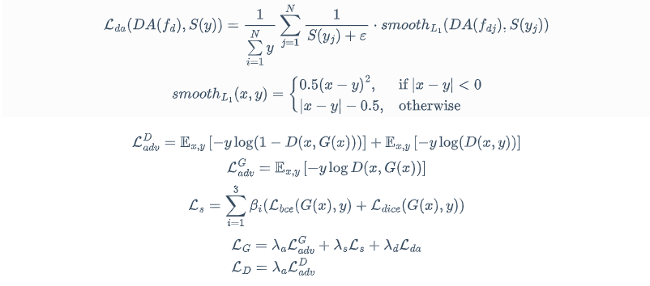

## RIP-AV: Joint Representative Instance Pre-training and Context Aware Network for Retinal Artery/Vein Segmentation

## ⏰:Update 2025-04-10: the visulation tools about RIP-AV is online in 🤠:huggingface [https://huggingface.co/spaces/weidai00/RIP-AV-su-lab](https://huggingface.co/spaces/weidai00/RIP-AV-su-lab)
> ### :o: Contribution:
>
> :arrow_forward:<em>The first attempt to joint the <b>Representative Instance Pre-training</b> (RIP) with the contextual analysis of local patch for <b>retinal A/V segmentation</b>.</em>
>
> :arrow_forward:<em>The RIP task is proposed to learn <b>latent arteriovenous features</b> from diverse spatial regions.</em>
>
> :arrow_forward:<em><b>Distance Aware</b> and <b>Patch Context Fusion</b> modules are desgined to explore the relationship of patch and its context base on the sense of vascular structures.</em>
>
> :arrow_forward:<em>Validated against three datasets, outperforming state-of-the-art methods. </em>


<div style="text-align: center">
  
</div>


## &#x1F527; Usage

###  :zap: Dependencies

[]()

[]()

[]()

[]()

Conda environment settings:

 ```shell
 conda create -n rip_av python=3.10 -y
 conda activate rip_av
 pip install poetry 
 poetry install
 pip install tensorflow==2.9.1
 pip install torch==1.13.1 torchvision torchaudio --extra-index-url https://download.pytorch.org/whl/cu117 --force
```
If you encounted `numpy` error during runing the project:
```
 pip install numpy==2.2.4
 pip install scikit-image=0.25.2 
```

## :rocket: Preparing Segmentation Datasets

Download the public datasets: [AV-DRIVE](https://drive.google.com/drive/folders/1SdOyBnN91hOPMNuw69_r21yJaXgsiohT?usp=drive_link), [LES-AV](https://drive.google.com/drive/folders/1VMugPO4PwtrJtjdqYJKwcM1Zozc-CsDV?usp=drive_link), HRF ([v1](https://drive.google.com/drive/folders/1A_OFBTydx5y_XuazaypUp4C9ezS3R-gR?usp=drive_link), [v2](https://drive.google.com/drive/folders/11ZSXwxxhJ02KuKWdEg_PhAocu2UqZ5NR?usp=drive_link)) and put in the `./data`

```
├─dataset

​	├─test 
​	│  ├─av
​	│  └─images
​	└─training
​    	├─av
​    	└─images
```

## :sunny: Training stage

There are two stage: RIP-stage and segmentation stage.

### :one: RIP Stage

Run `Preprocessing/generate_patch_selection_for_RIP.py` to generate <b>representative patches</b> for **RIP stage**, or directly use the pretrained weights.

```
python generate_patch_selection_for_RIP.py 
	--dataset_path <dataset path>
	-- train_or_test <training|test>
    --out <output path>
cd ./RIP/
python train.py
```





| Dataset  | Pretrain weight                                              |
| -------- | ------------------------------------------------------------ |
| AV-DRIVE | [RIP_pretrain_drive](https://drive.google.com/file/d/1ofz2WNXCVfpjXGvoGzneS5PVb7mAhcIG/view?usp=sharing) |
| LES-AV   | [RIP_pretrain_les](https://drive.google.com/file/d/1EB0ZKa3-9yCq9_RgcfFaU7Ut3SPLdXya/view?usp=sharing) |
| HRF      | [RIP_pretrain_hrf](https://drive.google.com/file/d/1eyqpM0p5hmBhk1jze782UxLtETYuCNg6/view?usp=sharing) |

#### :rainbow: Tsne visualization results (W/O RIP)



<p align='center' style='margin-top:0px;margin-bottom:0px;'><b>AV-DRIVE</b></p>



<p align='center'><b>LES-AV</b></p>



<p align='center'><b>HRF</b></p>

### :two:Segmentation Stage

```shell
# train and evaluate  
cd AV/
python main config/config_train_general

# change config file and run test with visulization
python test_with_vis.py

```



where the hyper-parameters ${{\lambda }_{a}}$, ${{\lambda }_{s}}$, ${{\lambda }_{d}}$ are meticulously calibrated to balance these three losses and set as 0.01, 5 and 1, respectively, see `./AV/config/config_train_general.py`.

| Dataset   | checkpoint                                                    |
| -------- | ------------------------------------------------------------ |
| AV-DRIVE  | [RIP_checkpoint_drive](https://drive.google.com/file/d/1AUtWDTS6LutsHpB_hHfopUFqEDa-JUnT/view?usp=sharing)  |
| LES-AV    | [RIP_checkpoint_les](https://drive.google.com/file/d/1iFWqhxsnOH3h-j1CKJ7NPL_AmdM7lTjm/view?usp=sharing)  |
| HRF       | [RIP_checkpoint_hrf](https://drive.google.com/file/d/1a21dNW92n-YAACtL_blJHcwkSshKSABC/view?usp=sharing)  |

#### :rainbow: Segmentation Performance


Full prediction results can be available at [AV-DRIVE](https://drive.google.com/drive/folders/1sKliquaxXwesrzlWAsXP5xjNaWpJXAuL?usp=sharing), [LES-AV](https://drive.google.com/drive/folders/1djAWENC-T7C7sCk9UjR0qZG18XuFyrTl?usp=sharing), [HRF](https://drive.google.com/drive/folders/1f3_5LjwGZRaDp4sOEZyQoyzHvolJFkIN?usp=sharing).

### :memo:To-Do List

- [x] training and test code
- [x] visualization demo
- [x] test on more retinal dataset
- [ ] train and test on more UWF and ROP dataset

